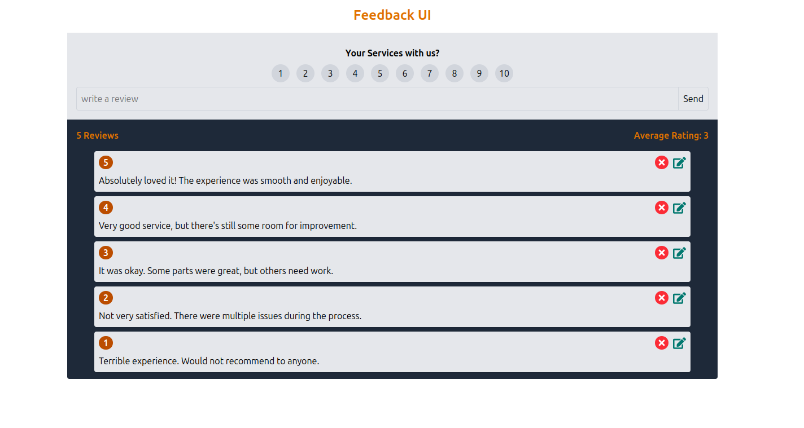

# Feedback App

<a href='https://feedback-react123.netlify.app/'>Preview</a>

## Features

- **Add Feedback**: Users can submit feedback with a rating and description.
- **Feedback List**: Displays a list of all feedback entries with options to edit or delete.
- **Dynamic Rating System**: Allows users to rate their experience on a scale.
- **Responsive Design**: Optimized for both desktop and mobile devices.
- **State Management**: Uses React Context API for managing global state.

## Technologies Used

- **React**: For building the user interface.
- **Vite**: For fast development and build tooling.
- **Tailwind CSS**: For styling the application.
- **React Context API**: For state management

## Screenshots

### Home Page

